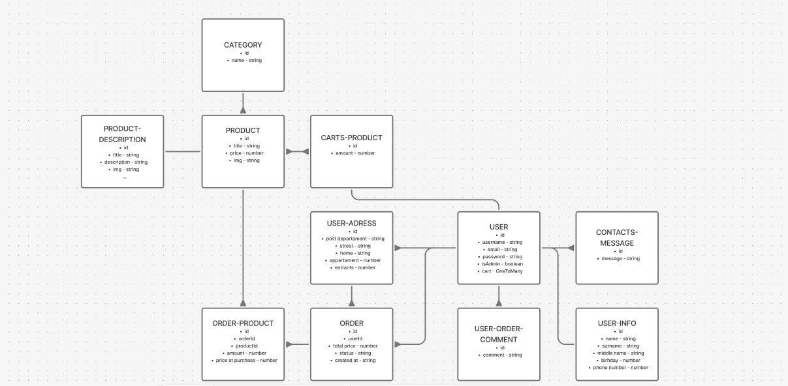
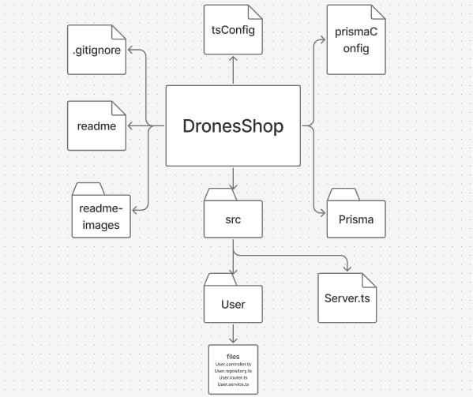

# Drones shop - "Онлайн магазин дронів"
<details>
<summary>
English Version
</summary>
</details>

---
## Drones Shop- <i>це проект для продажу дронів та аксесуарів для них, з максимумом можливостей та комфортом у використанні
</i>

## Навігація
- [Склад команди](#склад-команди)
- [Схема звязків моделей](#схема-звязків-моделей)
- [Технології](#технології)
- [Структура файлів та додатків](#Структура-файлів-та-додатків)
- [Endpoints map](Endpoints-map)

## Склад команди
1. [Dmytro Chepikov](https://github.com/DmytroChepikov/)
2. [Mihaylo Barylo](https://github.com/Mbarilo)
3. [Arkhip Gonchar](https://github.com/Arhip-ops)
4. [Kirill Kutovoy](https://github.com/Kutovoi-Kirill)

## Схема звязків моделей

[figma link](https://www.figma.com/board/8sZlkdrZdVMgHFVyFfKai9/Untitled?node-id=0-1&p=f&t=i0FnrydoOYYp2paS-0)

[Повернутись](#навігація)

## Як встановити?
1. Пропишіть в терміналі
```bash
git clone https://github.com/DmytroChep/DronesShopTeam3.git
```
2. Пропишіть в терміналі
```bash
npm i
```
3. 
```bash
    npm run start
```


## Технології
- <i> NodeJs - Основа, на якій написан і фронтенд і бекенд<i>
- <i> TypeScript(ts) - Модифікація на javascript який додає більш строгу типізацію, робить код чистим та спрощує роботу
- Backend
    - <i>Express - На ньому написан бекенд нашого додатка</i>
    - <i>Moment - Цей модуль потрібен щоб працювати з часота та датами</i>
- Frontend
    - <i>React - На ньому написан фронтенд нашого додатка</i>

[Повернутись](#навігація)

## Архітектура
### У нашому проекті ми використовуємо шарову архітектуру, тобто поділяється на модулі всередені які поділяються на:
- Router
- Middleware
- Controller
- Service
- Repository


## Стиль коду
1. Наіменування слоїв в додатках: AppName.LayerName.ts

## Структура файлів та додатків

[figma link](https://www.figma.com/board/iVCRy1Sy8jT8iKEpqyFegQ/Untitled?node-id=0-1&p=f&t=0hdD4q9BNgHjWD89-0)

## Endpoints map
[link](https://docs.google.com/document/d/16J9oeaAA7d49pJn2NrqgXStUggXNK79R3M1Gk9s4DeE/edit?usp=sharing)
